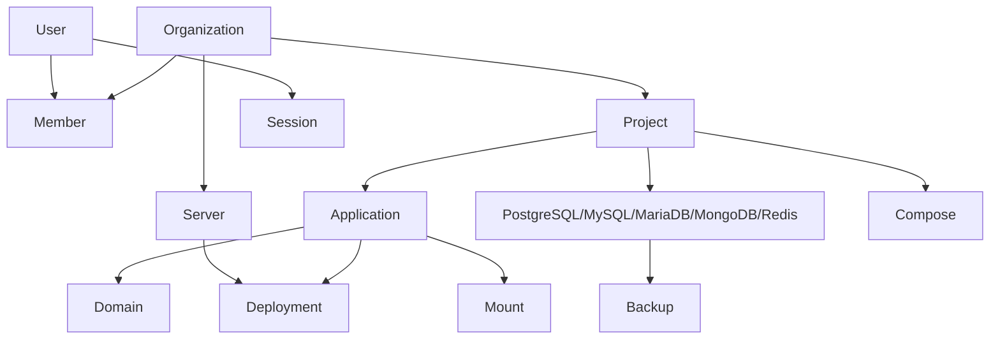

# Dokploy Database Schema Analysis

## Overview

Dokploy uses a sophisticated PostgreSQL database schema with 58+ tables supporting a comprehensive multi-tenant PaaS platform. The schema demonstrates enterprise-grade design patterns with proper relationships, indexing, and data integrity.

## Core Entity Relationships



## Multi-Tenancy Architecture

### Organization Structure
```sql
-- Core multi-tenant entity
organization (
  id UUID PRIMARY KEY,
  name TEXT NOT NULL,
  slug TEXT UNIQUE NOT NULL,
  logo TEXT,
  metadata JSONB,
  ownerId TEXT NOT NULL,
  createdAt TIMESTAMP DEFAULT NOW(),
  updatedAt TIMESTAMP DEFAULT NOW()
);

-- Role-based membership
member (
  id TEXT PRIMARY KEY,
  userId TEXT NOT NULL,
  organizationId TEXT REFERENCES organization(id),
  role member_role_enum NOT NULL, -- owner, admin, member
  -- Granular permissions
  canCreateProjects BOOLEAN DEFAULT false,
  canDeleteProjects BOOLEAN DEFAULT false,
  canAccessSSHKeys BOOLEAN DEFAULT false,
  canAccessDocker BOOLEAN DEFAULT false,
  canAccessAPI BOOLEAN DEFAULT false,
  -- Project-specific access
  projectsAccess TEXT[] DEFAULT '{}',
  applicationsAccess TEXT[] DEFAULT '{}',
  servicesAccess TEXT[] DEFAULT '{}'
);
```

### User Management
```sql
users_temp (
  id TEXT PRIMARY KEY,
  email TEXT UNIQUE NOT NULL,
  password TEXT,
  image TEXT,
  role user_role_enum, -- admin, user
  -- 2FA Support
  twoFactorSecret TEXT,
  twoFactorEnabled BOOLEAN DEFAULT false,
  -- Stripe Integration
  stripeCustomerId TEXT,
  stripeSubscriptionId TEXT,
  -- Server Management
  serverIp TEXT,
  sshPrivateKey TEXT,
  -- Monitoring Configuration
  enabledDashboard BOOLEAN DEFAULT true,
  dashboardPassword TEXT,
  serverNickname TEXT,
  maxContainersToMonitor INTEGER DEFAULT 30,
  diskFreeze BOOLEAN DEFAULT false
);
```

## Service Architecture

### Project Hierarchy
```sql
project (
  id TEXT PRIMARY KEY,
  name TEXT NOT NULL,
  description TEXT,
  organizationId TEXT REFERENCES organization(id),
  environmentName TEXT,
  createdAt TIMESTAMP DEFAULT NOW()
);
```

### Application Services
```sql
application (
  id TEXT PRIMARY KEY,
  name TEXT NOT NULL,
  appName TEXT NOT NULL,
  description TEXT,
  env TEXT,
  buildArgs TEXT,
  memoryReservation BIGINT,
  memoryLimit BIGINT,
  cpusReservation REAL,
  cpusLimit REAL,
  -- Source Configuration
  sourceType source_type_enum, -- github, gitlab, bitbucket, gitea, docker, git, drop
  repository TEXT,
  branch TEXT,
  buildPath TEXT,
  dockerfile TEXT,
  -- Build Configuration
  buildType build_type_enum, -- dockerfile, nixpacks, heroku, paketo, static, railpack
  publishDirectory TEXT,
  -- Docker Configuration
  dockerImage TEXT,
  username TEXT,
  password TEXT,
  -- Preview Deployments
  previewDeployments BOOLEAN DEFAULT false,
  randomizeDomains BOOLEAN DEFAULT false,
  -- Docker Swarm
  replicas INTEGER DEFAULT 1,
  -- Relationships
  projectId TEXT REFERENCES project(id),
  serverId TEXT REFERENCES server(id),
  createdAt TIMESTAMP DEFAULT NOW()
);
```

### Database Services (5 Types)
All database services follow a consistent pattern:

```sql
-- PostgreSQL example (similar for mysql, mariadb, mongo, redis)
postgres (
  id TEXT PRIMARY KEY,
  name TEXT NOT NULL,
  appName TEXT NOT NULL,
  description TEXT,
  env TEXT,
  memoryReservation BIGINT,
  memoryLimit BIGINT,
  cpusReservation REAL,
  cpusLimit REAL,
  -- Database Specific
  databaseName TEXT NOT NULL,
  databaseUser TEXT NOT NULL,
  databasePassword TEXT NOT NULL,
  rootPassword TEXT,
  dockerImage TEXT,
  command TEXT,
  -- External Access
  externalPort INTEGER,
  -- Docker Swarm
  replicas INTEGER DEFAULT 1,
  -- Relationships
  projectId TEXT REFERENCES project(id),
  serverId TEXT REFERENCES server(id),
  createdAt TIMESTAMP DEFAULT NOW()
);
```

### Compose Services
```sql
compose (
  id TEXT PRIMARY KEY,
  name TEXT NOT NULL,
  appName TEXT NOT NULL,
  description TEXT,
  env TEXT,
  composeFile TEXT NOT NULL,
  randomizeDomains BOOLEAN DEFAULT false,
  sourceType source_type_enum,
  repository TEXT,
  branch TEXT,
  -- Relationships
  projectId TEXT REFERENCES project(id),
  serverId TEXT REFERENCES server(id)
);
```

## Infrastructure Management

### Server Management
```sql
server (
  id TEXT PRIMARY KEY,
  name TEXT NOT NULL,
  description TEXT,
  ipAddress TEXT NOT NULL,
  port INTEGER DEFAULT 22,
  username TEXT NOT NULL,
  sshKeyId TEXT REFERENCES "ssh-key"(id),
  -- Monitoring Configuration
  enabledMonitoring BOOLEAN DEFAULT false,
  maxContainersToMonitor INTEGER DEFAULT 30,
  -- Docker Management
  enabledCleanupDocker BOOLEAN DEFAULT false,
  cleanupIntervalInMinutes INTEGER DEFAULT 1440,
  -- Relationships
  organizationId TEXT REFERENCES organization(id)
);
```

### Domain & SSL Management
```sql
domain (
  id TEXT PRIMARY KEY,
  host TEXT NOT NULL,
  port INTEGER DEFAULT 80,
  https BOOLEAN DEFAULT false,
  path TEXT DEFAULT "/",
  -- SSL Configuration
  certificateType certificate_type_enum, -- letsencrypt, none
  -- Internal Routing
  domainType domain_type_enum, -- compose, application, postgres, mariadb, mysql, mongo, redis
  serviceName TEXT,
  -- Relationships
  applicationId TEXT REFERENCES application(id),
  composeId TEXT REFERENCES compose(id),
  postgresId TEXT REFERENCES postgres(id),
  mariadbId TEXT REFERENCES mariadb(id),
  mysqlId TEXT REFERENCES mysql(id),
  mongoId TEXT REFERENCES mongo(id),
  redisId TEXT REFERENCES redis(id)
);

certificate (
  id TEXT PRIMARY KEY,
  name TEXT NOT NULL,
  certificateData TEXT NOT NULL,
  privateKey TEXT NOT NULL,
  certificatePath TEXT,
  autoRenew BOOLEAN DEFAULT false,
  organizationId TEXT REFERENCES organization(id)
);
```

## DevOps & Deployment

### Deployment Tracking
```sql
deployment (
  id TEXT PRIMARY KEY,
  title TEXT,
  description TEXT,
  status deployment_status_enum, -- running, done, error
  logPath TEXT,
  -- Deployment Types
  deploymentType deployment_type_enum, -- application, compose, backup, schedule
  -- Preview Deployments
  isPreviewing BOOLEAN DEFAULT false,
  previewId TEXT REFERENCES "preview-deployment"(id),
  -- Relationships
  applicationId TEXT REFERENCES application(id),
  composeId TEXT REFERENCES compose(id),
  serverId TEXT REFERENCES server(id),
  createdAt TIMESTAMP DEFAULT NOW()
);
```

### Git Provider Integration
```sql
-- Base git provider
git_provider (
  id TEXT PRIMARY KEY,
  name TEXT NOT NULL,
  gitProviderType git_provider_type_enum, -- github, gitlab, bitbucket, gitea
  organizationId TEXT REFERENCES organization(id)
);

-- GitHub integration example
github (
  id TEXT PRIMARY KEY,
  githubId INTEGER NOT NULL,
  installationId INTEGER NOT NULL,
  accountLogin TEXT NOT NULL,
  repositoryName TEXT NOT NULL,
  branch TEXT NOT NULL,
  -- Webhook Configuration
  webhookId TEXT,
  webhookUrl TEXT,
  -- Relationships
  applicationId TEXT REFERENCES application(id),
  gitProviderId TEXT REFERENCES git_provider(id)
);
```

### Backup System
```sql
backup (
  id TEXT PRIMARY KEY,
  prefix TEXT,
  database TEXT,
  schedule TEXT, -- Cron expression
  enabled BOOLEAN DEFAULT true,
  -- Backup Types
  postgresId TEXT REFERENCES postgres(id),
  mariadbId TEXT REFERENCES mariadb(id),
  mysqlId TEXT REFERENCES mysql(id),
  mongoId TEXT REFERENCES mongo(id),
  -- Destination
  destinationId TEXT REFERENCES destination(id),
  createdAt TIMESTAMP DEFAULT NOW()
);

destination (
  id TEXT PRIMARY KEY,
  name TEXT NOT NULL,
  accessKey TEXT NOT NULL,
  secretAccessKey TEXT NOT NULL,
  bucket TEXT NOT NULL,
  region TEXT,
  endpoint TEXT,
  organizationId TEXT REFERENCES organization(id)
);
```

## Monitoring & Operations

### Notification System
```sql
notification (
  id TEXT PRIMARY KEY,
  name TEXT NOT NULL,
  notificationType notification_type_enum, -- slack, discord, telegram, email, gotify
  -- Slack Configuration
  slackWebhookUrl TEXT,
  slackChannel TEXT,
  -- Discord Configuration
  discordWebhookUrl TEXT,
  -- Telegram Configuration
  telegramBotToken TEXT,
  telegramChatId TEXT,
  -- Email Configuration
  smtpServer TEXT,
  smtpPort INTEGER,
  smtpUser TEXT,
  smtpPassword TEXT,
  emailFrom TEXT,
  emailTo TEXT,
  -- Event Configuration
  appDeploy BOOLEAN DEFAULT false,
  appBuildError BOOLEAN DEFAULT false,
  databaseBackup BOOLEAN DEFAULT false,
  -- Relationships
  organizationId TEXT REFERENCES organization(id)
);
```

### Scheduling
```sql
schedule (
  id TEXT PRIMARY KEY,
  name TEXT NOT NULL,
  command TEXT NOT NULL,
  cron TEXT NOT NULL,
  timezone TEXT DEFAULT 'UTC',
  enabled BOOLEAN DEFAULT true,
  -- Docker Configuration
  dockerImage TEXT DEFAULT 'node:18-alpine',
  -- Relationships
  projectId TEXT REFERENCES project(id),
  serverId TEXT REFERENCES server(id)
);
```

## Security & Access Control

### SSH Key Management
```sql
"ssh-key" (
  id TEXT PRIMARY KEY,
  publicKey TEXT NOT NULL,
  privateKey TEXT NOT NULL,
  name TEXT NOT NULL,
  description TEXT,
  lastUsedAt TIMESTAMP,
  organizationId TEXT REFERENCES organization(id)
);
```

### Security Policies
```sql
security (
  id TEXT PRIMARY KEY,
  username TEXT,
  password TEXT,
  -- Relationships (flexible security assignment)
  applicationId TEXT REFERENCES application(id),
  composeId TEXT REFERENCES compose(id)
);

redirects (
  id TEXT PRIMARY KEY,
  regex TEXT NOT NULL,
  replacement TEXT NOT NULL,
  permanent BOOLEAN DEFAULT false,
  -- Relationships
  applicationId TEXT REFERENCES application(id),
  composeId TEXT REFERENCES compose(id)
);
```

## Enterprise Features Present

### 1. Multi-Tenancy
- Complete organization-based isolation
- Granular role-based permissions
- Resource access control

### 2. Scalability
- Multi-server deployment support
- Docker Swarm orchestration
- Resource limits and quotas

### 3. Security
- Comprehensive authentication system
- SSL/TLS certificate management
- SSH key management
- Network security policies

### 4. Operations
- Automated backup system
- Multi-channel notifications
- Deployment tracking and rollbacks
- Scheduled job management

### 5. Integration
- Multiple git provider support
- Container registry integration
- Webhook support
- API access management

## Schema Statistics

- **Total Tables**: 58+
- **Core Entities**: 15 (Organization, Project, Application, Databases, etc.)
- **Support Tables**: 43+ (Deployments, Domains, Backups, etc.)
- **Relationship Types**: 1:N, N:N through junction tables
- **Indexing**: Comprehensive indexing on foreign keys and query patterns
- **Data Types**: Rich type system with ENUMs, JSONB, Arrays
- **Constraints**: Foreign key constraints ensuring data integrity

## Assessment for Enterprise

### Strengths
✅ **Mature Schema**: Well-designed with proper relationships
✅ **Multi-Tenancy**: Complete organization isolation
✅ **Scalability**: Designed for horizontal scaling
✅ **Security**: Comprehensive security features
✅ **Flexibility**: JSONB for extensible metadata
✅ **Operations**: Full operational feature support

### Enhancement Opportunities
🔄 **Audit Logging**: Enhanced audit trail tables
🔄 **Workflow Management**: Approval workflow tables
🔄 **Cost Tracking**: Resource usage and cost tables
🔄 **Compliance**: Policy and compliance tables
🔄 **Advanced RBAC**: More granular permission system
🔄 **Multi-Cluster**: Kubernetes cluster management tables

The current schema provides an excellent foundation for enterprise features with minimal structural changes required.