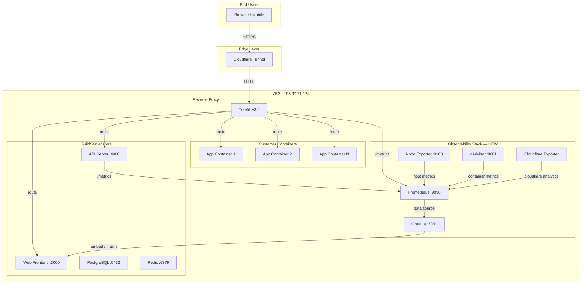

# GuildServer PaaS — Full Observability Implementation Plan

End-to-end metrics collection, storage, and visualization using **Prometheus + Grafana**, integrated into the existing Docker Compose infrastructure.

---

## Architecture Overview



---

## Data Flow: How Each Metric Gets to Grafana

| Source | Exporter | Prometheus Scrape Target | Grafana Dashboard |
|--------|----------|------------------------|-------------------|
| VPS Host (CPU, RAM, disk, network, load) | **Node Exporter** (`prom/node-exporter`) | `:9100/metrics` | Host Infrastructure |
| All Docker Containers (CPU, mem, net, I/O) | **cAdvisor** (`gcr.io/cadvisor/cadvisor`) | `:8081/metrics` | Container Resources |
| Traefik (request count, latency, status codes per route) | **Built-in** (Traefik Prometheus provider) | `:8080/metrics` | Edge & Routing |
| GuildServer API (deploy count, build duration, queue depth, custom) | **Custom `/metrics` endpoint** (prom-client) | `:4000/metrics` | Deployment Pipeline |
| Cloudflare (bandwidth, cache hit, geo, threats) | **Cloudflare Exporter** | `:9199/metrics` | Edge & CDN |
| Customer Apps (optional SDK) | **Push Gateway** or direct scrape | Per-app `:PORT/metrics` | Application Performance |

---

## What Will Be Added to the Stack

### New Docker Compose Services

These 4 services will be added to [docker-compose.prod.yml](file:///Users/user/GuildServer/guildserver-paas/docker-compose.prod.yml):

#### 1. Prometheus (Time-Series Database)
- **Image:** `prom/prometheus:v2.53.0`
- **Port:** `9090` (internal only, accessed via Traefik)
- **Storage:** `prometheus_data` volume (persistent)
- **Config:** `./monitoring/prometheus.yml` (scrape targets)
- **Retention:** 30 days by default (`--storage.tsdb.retention.time=30d`)

#### 2. Grafana (Visualization)
- **Image:** `grafana/grafana:11.1.0`
- **Port:** `3001` (exposed via Traefik at `grafana.guildserver.io` or `/grafana`)
- **Storage:** `grafana_data` volume (persistent dashboards)
- **Config:** Auto-provisioned data source (Prometheus) + dashboards via JSON files
- **Auth:** Embedded mode for GuildServer dashboard integration, admin access for standalone

#### 3. Node Exporter (VPS Host Metrics)
- **Image:** `prom/node-exporter:v1.8.1`
- **Port:** `9100` (internal only)
- **Volumes:** Read-only mounts to `/proc`, `/sys`, `/` for host-level metrics
- **Collects:** CPU per core, RAM, disk I/O, network interfaces, load average, file descriptors, swap

#### 4. cAdvisor (Container Metrics)
- **Image:** `gcr.io/cadvisor/cadvisor:v0.49.1`
- **Port:** `8081` (internal only)
- **Volumes:** Read-only Docker socket + cgroup/sys mounts
- **Collects:** Per-container CPU, memory, network, disk I/O, restart count — for ALL containers including customer apps

---

### New Files to Create

```
monitoring/
├── prometheus.yml                 # Prometheus scrape configuration
├── alerting-rules.yml             # Prometheus alerting rules
├── grafana/
│   ├── provisioning/
│   │   ├── datasources/
│   │   │   └── prometheus.yml     # Auto-configure Prometheus as data source
│   │   └── dashboards/
│   │       └── dashboard.yml      # Auto-load dashboard JSON files
│   └── dashboards/
│       ├── host-infrastructure.json    # VPS CPU, RAM, disk, network
│       ├── container-resources.json    # Per-container metrics
│       ├── traefik-routing.json        # Request rate, latency, status codes
│       ├── deployment-pipeline.json    # Build time, success rate, MTTR
│       ├── application-overview.json   # Combined app-level view
│       └── cloudflare-edge.json        # CDN analytics (if CF exporter enabled)
```

---

### Existing Files to Modify

#### [MODIFY] [docker-compose.prod.yml](file:///Users/user/GuildServer/guildserver-paas/docker-compose.prod.yml)
- Add `prometheus`, `grafana`, `node-exporter`, `cadvisor` services
- Add `prometheus_data`, `grafana_data` volumes
- Add Traefik metrics command flags: `--metrics.prometheus=true`, `--metrics.prometheus.addEntryPointsLabels=true`, `--metrics.prometheus.addServicesLabels=true`
- Add Traefik route for Grafana (`grafana.${BASE_DOMAIN}`)
- Add Traefik route for Prometheus (admin-only access)

#### [MODIFY] Traefik command section
Add 3 flags to enable built-in Prometheus metrics:
```yaml
- "--metrics.prometheus=true"
- "--metrics.prometheus.addEntryPointsLabels=true"
- "--metrics.prometheus.addServicesLabels=true"
```
This immediately exposes per-route request count, latency histograms, and HTTP status code breakdowns on `:8080/metrics`.

#### [NEW] `apps/api/src/services/prometheus-metrics.ts`
- Use `prom-client` npm package to expose a `/metrics` endpoint on the API server
- Custom metrics:
  - `guildserver_deployments_total` (counter, labels: status, app_name)
  - `guildserver_deployment_duration_seconds` (histogram)
  - `guildserver_build_duration_seconds` (histogram)
  - `guildserver_active_containers` (gauge)
  - `guildserver_webhook_deliveries_total` (counter, labels: provider, status)
  - `guildserver_queue_depth` (gauge, labels: queue_name)
  - `guildserver_api_requests_total` (counter, labels: method, path, status)
  - `guildserver_api_request_duration_seconds` (histogram)

#### [MODIFY] [apps/api/src/queues/setup.ts](file:///Users/user/GuildServer/guildserver-paas/apps/api/src/queues/setup.ts)
- Increment `guildserver_deployments_total` counter on deployment complete/fail
- Observe `guildserver_deployment_duration_seconds` histogram with actual timing
- Update `guildserver_queue_depth` gauge periodically

#### [MODIFY] API server entry point (Express app)
- Mount `/metrics` endpoint serving `prom-client` registry output
- Add Express middleware to count requests and measure latency

---

## Prometheus Scrape Configuration

```yaml
# monitoring/prometheus.yml
global:
  scrape_interval: 15s
  evaluation_interval: 15s

rule_files:
  - "alerting-rules.yml"

scrape_configs:
  # 1. Prometheus self-monitoring
  - job_name: "prometheus"
    static_configs:
      - targets: ["localhost:9090"]

  # 2. VPS Host Metrics (Node Exporter)
  - job_name: "node-exporter"
    static_configs:
      - targets: ["node-exporter:9100"]
    relabel_configs:
      - source_labels: [__address__]
        target_label: instance
        replacement: "vps-primary"

  # 3. Container Metrics (cAdvisor)
  - job_name: "cadvisor"
    static_configs:
      - targets: ["cadvisor:8081"]
    metric_relabel_configs:
      # Only keep GuildServer-managed containers
      - source_labels: [container_label_gs_managed]
        regex: "true"
        action: keep

  # 4. Traefik Routing Metrics
  - job_name: "traefik"
    static_configs:
      - targets: ["traefik:8080"]

  # 5. GuildServer API Custom Metrics
  - job_name: "guildserver-api"
    static_configs:
      - targets: ["api:4000"]
    metrics_path: "/metrics"

  # 6. Cloudflare Exporter (optional, requires API token)
  # - job_name: "cloudflare"
  #   static_configs:
  #     - targets: ["cloudflare-exporter:9199"]
```

---

## Grafana Dashboard Design

### Dashboard 1: Host Infrastructure
**Panels:**
- CPU Usage % (per core, stacked area chart)
- Memory Usage (used / buffered / cached / free, stacked)
- Disk Usage % (per mount)
- Disk I/O (read/write MB/s)
- Network Traffic (ingress/egress Mbps per interface)
- Load Average (1m, 5m, 15m line chart)
- Swap Usage
- Open File Descriptors vs limit

**Data Source:** Node Exporter via Prometheus

---

### Dashboard 2: Container Resources
**Panels:**
- Per-container CPU % (bar chart, sorted by usage)
- Per-container Memory (bar chart, usage vs limit)
- Container Network I/O (per container)
- Container Disk I/O (per container)
- Container Restart Count (table with alert indicators)
- Container Uptime (table)
- Total Containers by Status (running/stopped/errored pie chart)

**Data Source:** cAdvisor via Prometheus
**Filter:** Dropdown to select by `container_label_gs_app_id` (GuildServer app ID)

---

### Dashboard 3: Traefik — Edge & Routing
**Panels:**
- Total Requests/sec (per service/route)
- HTTP Status Code Distribution (2xx/3xx/4xx/5xx stacked area)
- Request Latency (p50, p95, p99 per service)
- Bandwidth per Service (bytes in/out)
- Active Connections
- Top 10 Routes by Request Count
- Error Rate % (5xx / total)

**Data Source:** Traefik built-in metrics via Prometheus

---

### Dashboard 4: Deployment Pipeline
**Panels:**
- Deployments per Day (bar chart, stacked by status)
- Build Duration (p50, p95 histogram over time)
- Deploy Duration (p50, p95 histogram over time)
- Success Rate % (gauge)
- Mean Time to Recovery (MTTR) (line chart)
- Webhook Deliveries (by provider: GitHub/GitLab/Bitbucket)
- Queue Depth (deployment queue, monitoring queue)
- Current Active Builds (gauge)

**Data Source:** GuildServer API custom metrics via Prometheus

---

### Dashboard 5: Application Overview
**Panels:**
- Application Health Matrix (table: name, status, CPU, memory, uptime, last deploy)
- Request Rate per Application (from Traefik route labels)
- Error Rate per Application (from Traefik 5xx per route)
- Response Time per Application (from Traefik latency per route)
- Network Usage per Application (from cAdvisor)
- Recent Deployments Timeline (annotation overlay)

**Data Source:** Combined (cAdvisor + Traefik + API custom metrics)

---

### Dashboard 6: Cloudflare Edge (Optional)
**Panels:**
- Total Requests (cached vs uncached)
- Bandwidth Saved by Cache (%)
- Geographic Request Distribution (world map)
- Threat / Bot Traffic Blocked
- Top Countries
- SSL/TLS Version Distribution

**Data Source:** Cloudflare Exporter via Prometheus (requires `CLOUDFLARE_API_TOKEN`)

---

## Alerting Rules

```yaml
# monitoring/alerting-rules.yml
groups:
  - name: infrastructure
    rules:
      - alert: HighCPU
        expr: 100 - (avg(rate(node_cpu_seconds_total{mode="idle"}[5m])) * 100) > 85
        for: 5m
        labels: { severity: warning }
        annotations: { summary: "VPS CPU above 85% for 5 minutes" }

      - alert: HighMemory
        expr: (1 - node_memory_MemAvailable_bytes / node_memory_MemTotal_bytes) * 100 > 90
        for: 5m
        labels: { severity: critical }
        annotations: { summary: "VPS memory above 90%" }

      - alert: DiskSpaceLow
        expr: (1 - node_filesystem_avail_bytes / node_filesystem_size_bytes) * 100 > 85
        for: 10m
        labels: { severity: warning }
        annotations: { summary: "Disk usage above 85%" }

  - name: containers
    rules:
      - alert: ContainerDown
        expr: absent(container_last_seen{name=~"gs-.*"}) 
        for: 2m
        labels: { severity: critical }

      - alert: ContainerHighMemory
        expr: container_memory_usage_bytes{name=~"gs-.*"} / container_spec_memory_limit_bytes > 0.9
        for: 5m
        labels: { severity: warning }

      - alert: ContainerRestarting
        expr: increase(container_restart_count{name=~"gs-.*"}[1h]) > 3
        for: 0m
        labels: { severity: warning }

  - name: deployments
    rules:
      - alert: HighDeploymentFailureRate
        expr: rate(guildserver_deployments_total{status="failed"}[1h]) / rate(guildserver_deployments_total[1h]) > 0.3
        for: 15m
        labels: { severity: warning }
        annotations: { summary: "More than 30% of deployments failing" }

  - name: traefik
    rules:
      - alert: HighErrorRate
        expr: sum(rate(traefik_service_requests_total{code=~"5.."}[5m])) / sum(rate(traefik_service_requests_total[5m])) > 0.05
        for: 5m
        labels: { severity: warning }
        annotations: { summary: "HTTP 5xx error rate above 5%" }
```

---

## GuildServer Dashboard Integration

Two approaches for surfacing Grafana within the GuildServer web UI:

### Option A: Embedded Grafana Panels (Recommended)
- Enable Grafana's `allow_embedding = true` and `cookie_samesite = none` settings
- Use `<iframe>` to embed specific Grafana panels directly into the existing [monitoring/page.tsx](file:///Users/user/GuildServer/guildserver-paas/apps/web/src/app/dashboard/monitoring/page.tsx)
- Users see rich Grafana visualizations without leaving GuildServer
- Grafana handles all the time-series rendering, zooming, and aggregation

### Option B: Standalone Grafana Link
- Route Grafana at `grafana.guildserver.io` via Traefik
- Add a "Open Grafana" button on the monitoring page
- Full Grafana experience with all dashboards

> [!IMPORTANT]
> **Recommendation:** Start with Option B (standalone link) for speed, then move to Option A (embedded panels) as a polish step.

---

## Phased Implementation

### Phase 1 — Infrastructure Foundation
**Time Estimate: ~2 hours**

1. Create `monitoring/` directory with `prometheus.yml` and alerting rules
2. Add Prometheus, Grafana, Node Exporter, cAdvisor to `docker-compose.prod.yml`
3. Add 3 Traefik metrics flags to existing Traefik command
4. Add Grafana provisioning files (auto-configure Prometheus data source)
5. Add new volumes: `prometheus_data`, `grafana_data`
6. Deploy and verify all 4 new services start correctly

**Result:** Prometheus is scraping Traefik, Node Exporter, and cAdvisor. Grafana is live with Prometheus as data source. You immediately have **host metrics, container metrics, and Traefik routing metrics** — that's Layers 2, 4, and 5 done.

### Phase 2 — API Custom Metrics
**Time Estimate: ~1.5 hours**

1. Install `prom-client` in `apps/api`
2. Create `apps/api/src/services/prometheus-metrics.ts` with custom counters/histograms
3. Mount `/metrics` endpoint on Express
4. Instrument deployment worker to record build/deploy duration
5. Instrument webhook handler to count deliveries
6. Add BullMQ queue depth gauge
7. Add API request count/latency middleware

**Result:** Prometheus now scrapes GuildServer-specific deployment and API metrics. Layer 6 (Deployment Pipeline) fully covered.

### Phase 3 — Grafana Dashboards
**Time Estimate: ~2 hours**

1. Create Dashboard 1: Host Infrastructure (from Node Exporter queries)
2. Create Dashboard 2: Container Resources (from cAdvisor queries)
3. Create Dashboard 3: Traefik Routing (from Traefik metrics)
4. Create Dashboard 4: Deployment Pipeline (from API custom metrics)
5. Create Dashboard 5: Application Overview (combined sources)
6. Export all as JSON, add to `monitoring/grafana/dashboards/` for auto-provisioning
7. Add "Open Grafana" link on GuildServer monitoring page

**Result:** Full visualization across all collected layers.

### Phase 4 — Cloudflare & Edge Intelligence (Optional)
**Time Estimate: ~1 hour**

1. Add Cloudflare Exporter to Docker Compose (requires `CLOUDFLARE_API_TOKEN`)
2. Add scrape target in Prometheus config
3. Create Dashboard 6: Cloudflare Edge (geo map, cache, bandwidth, threats)

**Result:** Layer 2 (Edge) fully covered with CDN-level visibility.

### Phase 5 — Dashboard Embedding & Polish
**Time Estimate: ~1.5 hours**

1. Configure Grafana for embedding (`allow_embedding`, anonymous access for embedded panels)
2. Update [monitoring/page.tsx](file:///Users/user/GuildServer/guildserver-paas/apps/web/src/app/dashboard/monitoring/page.tsx) to embed key Grafana panels
3. Keep existing real-time WebSocket metrics alongside embedded Grafana charts
4. Add dropdown to select time ranges that sync with Grafana panel URLs

**Result:** Users see Grafana-quality visualizations directly inside GuildServer without leaving the platform.

---

## Verification Plan

### Automated
- `docker compose ps` — verify all 4 new services are running
- `curl http://localhost:9090/-/healthy` — Prometheus is alive
- `curl http://localhost:3001/api/health` — Grafana is alive
- `curl http://localhost:9100/metrics | head -5` — Node Exporter responding
- `curl http://localhost:8081/metrics | head -5` — cAdvisor responding
- `curl http://localhost:8080/metrics | grep traefik_` — Traefik metrics enabled
- `curl http://localhost:4000/metrics | grep guildserver_` — API custom metrics exposed

### Manual
- Open Grafana, verify Prometheus data source auto-configured
- Open Host Infrastructure dashboard, confirm CPU/RAM charts populated
- Open Container Resources dashboard, confirm per-container breakdown visible
- Deploy a test application, confirm deployment metrics appear in Pipeline dashboard
- Open Traefik dashboard, confirm request count incrementing on page loads

---

## Resource Impact

| Service | CPU | RAM | Disk |
|---------|-----|-----|------|
| Prometheus | ~0.5% idle, 2-5% during scrapes | ~200-500 MB (depends on metric cardinality) | ~1-5 GB/month (30-day retention) |
| Grafana | ~0.1% idle, 1% during dashboard loads | ~50-100 MB | ~50 MB (dashboards + plugins) |
| Node Exporter | ~0.1% | ~15 MB | None |
| cAdvisor | ~1-2% | ~50-100 MB | None |
| **Total** | ~2-8% | ~315-715 MB | ~1-5 GB/month |

> [!WARNING]
> Your VPS should have at least **1 GB free RAM** to comfortably run the observability stack. If your VPS is tight on resources, we can skip cAdvisor initially and rely on the existing Docker stats collection.

---

## Open Questions

> [!IMPORTANT]
> **Grafana Access:** Should Grafana be publicly accessible at `grafana.guildserver.io`, or restricted to admin users only (with basic auth or IP whitelist)?

> [!IMPORTANT]
> **Cloudflare API Token:** Do you have one available? If so, we can enable the Cloudflare Exporter in Phase 4 for CDN-level metrics (geo map, cache hit rate, bandwidth saved, threats blocked).

> [!IMPORTANT]
> **VPS Resources:** How much RAM does your VPS have? The full stack (Prometheus + Grafana + Node Exporter + cAdvisor) adds ~300-700 MB of memory usage. If your VPS has ≤2 GB total, we may need to skip cAdvisor or use lighter alternatives.

> [!IMPORTANT]
> **Retention:** How long should metrics be kept? Default is 30 days. Longer retention = more disk usage (~1-5 GB/month).
